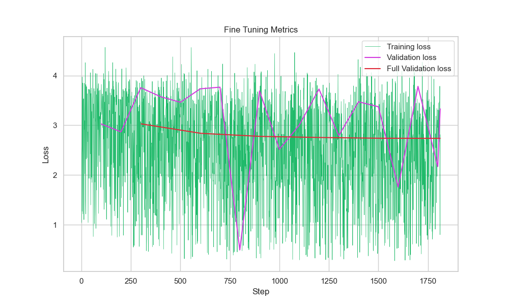

# New York School of Poetry Final Project

This repository contains the final project for **En/VC 117: New York School of Poets**, taught by Professor Josh Schneiderman at the California Institute of Technology during Winter Term 2025. The project employs advanced machine learning techniques to generate poems in the style of Frank O’Hara based on user-provided prompts. The instructions below guide you through the setup and operation of the application.

---

*Note: The following instructions are intended for macOS users and are written to be accessible to individuals without a technical background.*

## Installation

1. **Download the Project:**
   - Click the green **Code** button on the GitHub repository page.
   - Select **Download ZIP** and save the file to your computer.
   - Unzip the downloaded file.

2. **Open Terminal:**
   - Press `Command + Space` to open Spotlight Search.
   - Type `Terminal` and press `Enter` to launch the Terminal application.

3. **Navigate to the Project Directory:**
   - In Terminal, type `cd ` (including a trailing space). Do not press `Enter` yet.
   - Drag and drop the unzipped project folder into the Terminal window to automatically insert its path.
   - Press `Enter`. The command should appear as follows:
     ```bash
     cd <path/to/project/folder>
     ```

4. **Run the Setup Script:**
   - In Terminal, copy and paste the command below and press `Enter`:
     ```bash
     ./setup.sh
     ```
   - This script installs Homebrew, Python3, and any other necessary dependencies that are not already present on your computer. This setup is only required once.

## Running the Application

1. **Start the Application:**
   - In Terminal, enter the following command and press `Enter`:
     ```bash
     ./run.sh
     ```
   - The application will start and display a local URL (e.g., `http://XXX.X.X.X:5000/`). This will only work after the setup script has been executed.

2. **Generate a Poem:**
   - Open the provided URL in your web browser.
   - Enter a prompt in the text box and click the **Generate Poem** button.
   - The application will generate a poem in the style of Frank O’Hara based on your prompt.

## Stopping the Application

- To stop the application, return to the Terminal window and press `Control + C`.

## Notes

- Ensure you have a stable internet connection during both the setup and usage of the application.
- For troubleshooting, refer to the section below.

## Troubleshooting

If you encounter any issues, please contact [Jonathan Booker](mailto:jbooker@caltech.edu) for further assistance.

---

# Development Process

This section provides an overview of the development process, which leverages the OpenAI API to fine-tune a pre-trained model (`gpt-4o`) using data derived from Frank O’Hara’s poetry.

## Extracting Data

The training data for this project was sourced from *Frank O’Hara’s Selected Poems* (edited by Mark Ford, Alfred A. Knopf, 2008), providing a genuine textual foundation for model fine-tuning. The process involved the following steps:

1. **Preparing the PDF:**
   - A copy of the PDF was created.
   - Pages prior to page 3 and after page 246 were removed to retain only the poems.
   - The modified PDF was then saved.

2. **Extracting Text:**
   - The text was extracted from the PDF using Optical Character Recognition (OCR) and Adobe Acrobat.
   - Execute the following command in Terminal to extract the text:
     ```bash
     pdftotext -layout "util/data/Frank O'Hara - Selected Poems (1).pdf" "util/data/extracted.txt"
     ```

3. **Parsing the Text:**
   - The extracted text was processed using the Python script `util/poem_parser.py` to remove extraneous content and isolate the poems.
   - Run the script with the following command:
     ```bash
     python util/poem_parser.py
     ```

## Fine-Tuning

Fine-tuning adapts a general-purpose pre-trained model for a specialized task—in this case, generating poetry in the style of Frank O’Hara.

### Key Concepts

- **Pre-Trained Model:** A model trained on a large, general-purpose dataset that captures broad linguistic patterns.
- **Training Data:** A curated dataset of Frank O’Hara’s poems used to fine-tune the model.
- **Validation Data:** A separate subset of data used to evaluate performance and prevent overfitting during training.

### Process Overview

1. **Data Preparation:**
   - **Tokenization and Formatting:** The raw text is tokenized and formatted into a JSON Lines (JSONL) file containing prompt-completion pairs as training examples.
   - **Data Augmentation:** The `generate_data.py` script creates multiple prompt variants for each poem, enhancing the diversity and robustness of the training data.

2. **Fine-Tuning Execution:**
   - The resulting JSONL file is uploaded as the training dataset using the OpenAI CLI.
   - A separate validation dataset is used periodically during training to assess model performance and adjust parameters as necessary.

3. **Validation Data:**
   - This dataset is essential for monitoring performance, preventing overfitting, and ensuring that the model generalizes well to new examples.

### Data Generation Implementation

The `generate_data.py` script converts a curated collection of poems into a fine-tuning dataset tailored for conversational AI. The script:
- Reads an input JSON file containing each poem's title and content.
- Utilizes a meta-prompt to generate two distinct creative prompt variants per poem—one with detailed literary guidance and one that is more concise.
- Randomly selects a temperature setting for each API call to ensure prompt diversity.
- Formats each example into a conversational exchange (system, user, and assistant messages).
- Shuffles and partitions the data into training and validation datasets, saved in JSONL format for seamless integration with the OpenAI fine-tuning pipeline.

### Fine-Tuning Execution

The pre-trained `gpt-4o` model was fine-tuned using the prepared datasets to generate stylistically coherent and contextually relevant poetry. The process was executed using the OpenAI CLI via a web browser by uploading the `training_data.jsonl` file as the training dataset and the `validation_data.jsonl` file as the validation dataset.

#### Hyperparameters

- **Batch Size:** Set to 2, determining the number of training examples processed per iteration.
- **Learning Rate ($\beta$):** Set to 0.01, controlling the rate at which the model adjusts its parameters during training.
- **Epochs:** Set to 6, specifying the number of complete passes through the training dataset.

#### Analysis



The fine-tuned model in this project was designed to generate original poetry in the style of Frank O’Hara, adapting a general-purpose GPT-4 model to a highly specific literary voice. Analyzing the training process through the plotted loss metrics provides key insights into how effectively the model has learned this stylistic transformation. The training loss, which reflects the model’s performance on the curated dataset of prompt-completion pairs during fine-tuning, shows significant volatility across steps. This erratic pattern suggests that the model was either highly sensitive to batch-level fluctuations or that the training parameters—particularly the learning rate—may have been too aggressive. Such noise obscures the signal of improvement and raises concerns about whether the model was able to stabilize during fine-tuning.

In contrast, the validation loss, which is calculated on a separate subset of unseen prompt-completion examples, exhibits a more controlled trajectory but still lacks a clear downward trend. The fluctuations in validation loss suggest that the model was not consistently improving its generalization to new inputs, a key requirement for producing reliably high-quality poetic outputs in novel contexts. While some local improvements are visible—such as isolated dips in the validation loss—the lack of sustained decline indicates that the model may not have been learning more about the poetic structure or style beyond its initial performance.

The most telling metric is the Full Validation loss, which aggregates performance over a broader or more representative validation set. This curve is nearly flat, with only a subtle decrease throughout the training process. This suggests that, on the whole, the fine-tuned model’s ability to produce stylistically faithful and coherent poems did not meaningfully improve during training. Since this model is ultimately intended to generate new poems in the spirit of Frank O’Hara given arbitrary user prompts, stagnation in Full Validation loss implies that the model is not becoming significantly better at capturing the nuances of his style—an essential quality for the application’s success.

Taken together, the loss metrics indicate that while the model likely learned some features of O’Hara’s voice during the initial epochs, fine-tuning did not substantially improve its performance over time. This outcome may be due to the limited size of the dataset, suboptimal hyperparameters, or lack of regularization mechanisms. For future iterations, incorporating more diverse prompt-completion pairs, reducing the learning rate, or implementing a more aggressive early stopping criterion may help the model better internalize the stylistic hallmarks of Frank O’Hara’s poetry and thus perform more reliably in its generative role.